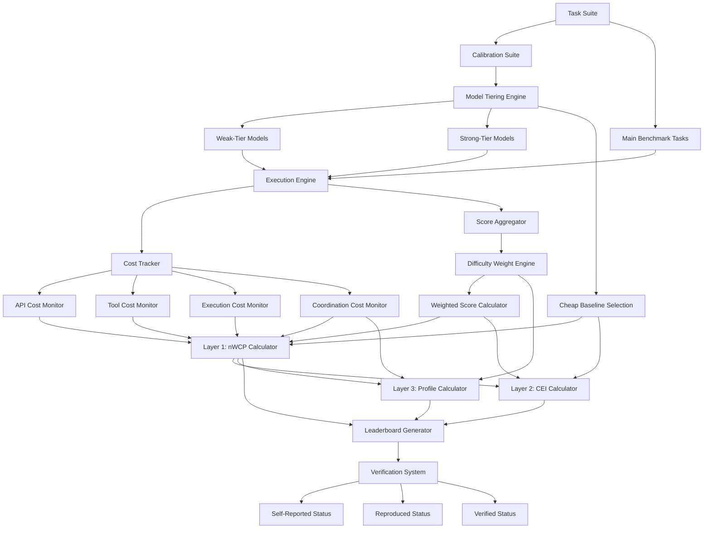
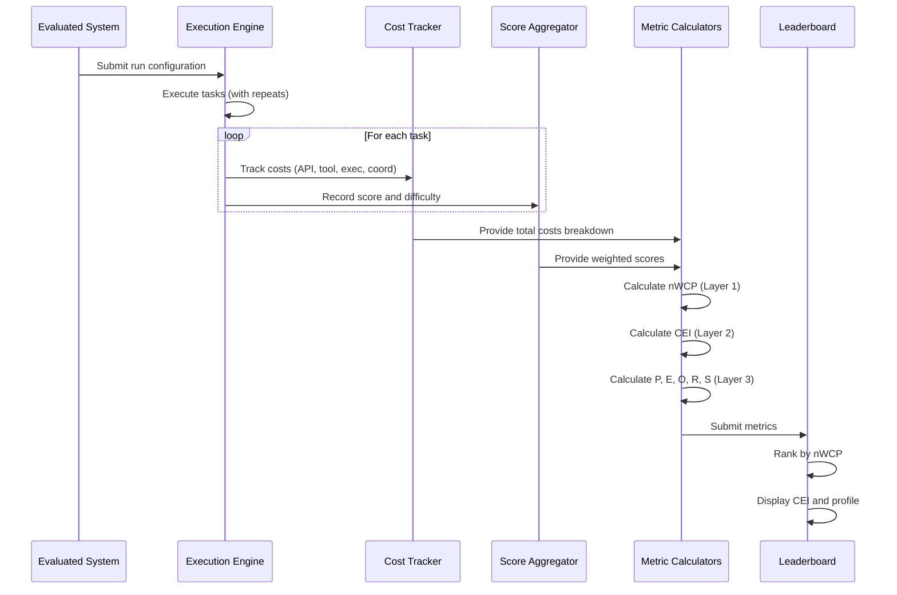
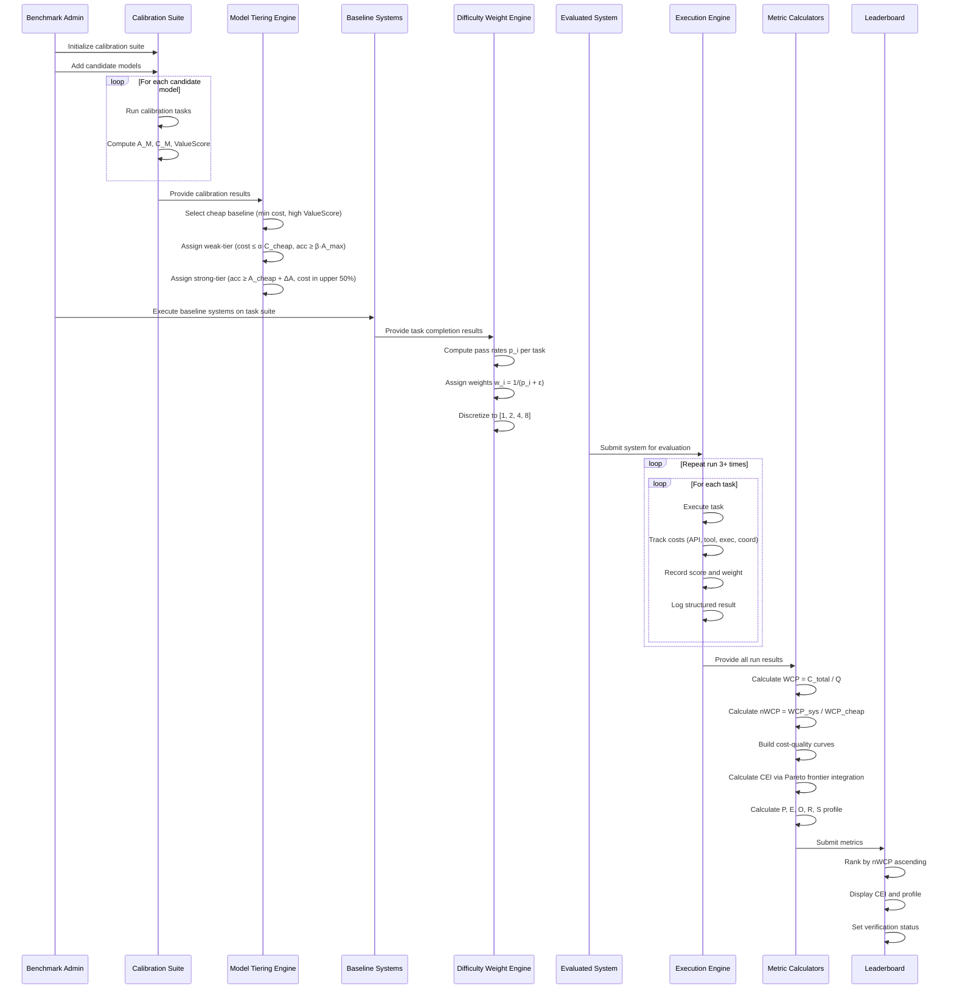

# Design Document: FrugalBench Scoring System

## Overview

FrugalBench is a cost-aware AI system evaluation benchmark that addresses critical weaknesses in existing benchmarks by implementing a comprehensive three-layer scoring architecture. The system evaluates AI agents and LLM-based systems through the lens of cost-efficiency, answering the fundamental question: "Which system truly achieves 'spend less, solve more'?" Unlike traditional accuracy-only benchmarks, FrugalBench treats real deployment costs as a first-class concern, providing rankings, interpretability metrics, and anti-gaming mechanisms to ensure trustworthy comparisons across different time periods, price changes, and system architectures.

The three-layer architecture consists of: (1) nWCP (Normalized Weighted Cost per Point) as the primary ranking metric, normalized against a cheap baseline for cross-temporal comparability; (2) CEI (Cost Efficiency Improvement Index) as a secondary metric based on Pareto frontier analysis to reveal cost-performance curves; and (3) a five-dimensional profile (P, E, O, R, S) providing interpretability across performance, efficiency, overhead, robustness, and stability dimensions. The system also implements automatic weak/strong model tiering through a calibration protocol, adaptive difficulty weighting based on baseline pass rates, and multiple anti-gaming mechanisms to prevent manipulation through simple-task optimization or excessive coordination overhead.

## Architecture

### System Components



### Data Flow Architecture



## Components and Interfaces

### Component 1: Calibration Suite

**Purpose**: Automatically assign models to weak-tier or strong-tier categories based on cost-accuracy characteristics, eliminating subjective model naming and gaming potential.

**Interface**:
```python
interface CalibrationSuite {
  runCalibration(model: Model): CalibrationResult
  selectCheapBaseline(results: CalibrationResult[]): Model
  assignTier(model: Model, calibration: CalibrationResult): ModelTier
  getCandidateModels(): Model[]
}

type CalibrationResult = {
  model: Model
  accuracy: number  // A_M: weighted accuracy on calibration tasks
  totalCost: number  // C_M: total real cost
  valueScore: number  // A_M / C_M
  capabilityProfile: Record<string, number>
}

enum ModelTier {
  Weak = "weak",
  Strong = "strong",
  Excluded = "excluded"
}
```

**Responsibilities**:
- Execute calibration tasks across multiple capability dimensions (QA, math, coding, tool use)
- Compute cost-accuracy metrics for each candidate model
- Select cheap baseline (lowest cost, high ValueScore)
- Assign weak-tier (cost ≤ α·C_cheap AND accuracy ≥ β·A_max)
- Assign strong-tier (accuracy ≥ A_cheap + ΔA AND cost in upper 50th percentile)
- Version and track calibration parameters (α=1.5, β=0.6, ΔA=0.1 defaults)

### Component 2: Difficulty Weight Engine

**Purpose**: Automatically derive task difficulty weights from baseline pass rates, preventing gaming through unknown-before-submission difficulty assignments.

**Interface**:
```python
interface DifficultyWeightEngine {
  computePassRates(baselines: System[], tasks: Task[]): Map<TaskId, number>
  assignWeights(passRates: Map<TaskId, number>, mode: WeightMode): Map<TaskId, number>
  discretizeWeights(weights: Map<TaskId, number>): Map<TaskId, DiscreteWeight>
}

enum WeightMode {
  Continuous = "continuous",  // w_i = 1 / (p_i + ε)
  Discrete = "discrete"      // 1, 2, 4, 8 based on thresholds
}

type DiscreteWeight = 1 | 2 | 4 | 8  // Easy, Medium, Hard, Expert
```

**Responsibilities**:
- Run all baseline systems on task suite to compute pass rates
- Apply continuous weighting formula: w_i = 1 / (p_i + ε) where ε = 0.01
- Apply discrete weighting: 1 (p>0.75), 2 (0.40<p≤0.75), 4 (0.15<p≤0.40), 8 (p≤0.15)
- Handle edge cases (p_i = 0, p_i = 1)
- Store and version weight assignments per benchmark version

### Component 3: Cost Tracker

**Purpose**: Monitor and decompose all real costs incurred during system execution into four tracked categories.

**Interface**:
```python
interface CostTracker {
  trackApiCost(modelCall: ModelCall): void
  trackToolCost(toolCall: ToolCall): void
  trackExecutionCost(runtime: RuntimeInfo): void
  trackCoordinationCost(coordinationStep: CoordinationStep): void
  getCostBreakdown(taskId: TaskId): CostBreakdown
  getTotalCost(runId: RunId): CostBreakdown
}

type CostBreakdown = {
  apiCost: number        // C_api: model API costs (input/output tokens)
  toolCost: number       // C_tool: external tool/service costs
  executionCost: number  // C_exec: GPU/CPU/container costs
  coordinationCost: number  // C_coord: planner/reflection/debate/verification
  totalCost: number      // Sum of all components
}

type CoordinationStep = {
  type: "planner" | "reflection" | "debate" | "verification" | "voting" | "critic"
  cost: number
  timestamp: number
}
```

**Responsibilities**:
- Instrument all API calls with pricing tables (per-token costs)
- Track tool invocations (search APIs, databases, code execution)
- Monitor execution time and compute costs (GPU/CPU hours)
- Separately track coordination overhead (meta-cognitive operations)
- Aggregate costs per task and per run
- Support local model cost conversion (GPU time → equivalent cost)

### Component 4: Score Aggregator

**Purpose**: Compute weighted scores and aggregate results across tasks and difficulty levels.

**Interface**:
```python
interface ScoreAggregator {
  recordScore(taskId: TaskId, score: number, weight: number): void
  computeWeightedScore(runId: RunId): number
  computeDifficultyLayerScores(runId: RunId): Map<DifficultyLevel, LayerScore>
  getPerformanceMetric(runId: RunId): number
}

type LayerScore = {
  totalScore: number
  totalWeight: number
  averageScore: number
  taskCount: number
}

enum DifficultyLevel {
  Easy = "easy",
  Medium = "medium", 
  Hard = "hard",
  Expert = "expert"
}
```

**Responsibilities**:
- Record raw scores s_i ∈ [0,1] for each task
- Apply difficulty weights w_i to compute weighted scores
- Calculate total weighted score: Q = Σ(w_i · s_i)
- Partition scores by difficulty level for robustness analysis
- Support partial scoring (not just binary 0/1)
- Handle missing or failed tasks

### Component 5: nWCP Calculator (Layer 1)

**Purpose**: Compute the primary ranking metric - normalized weighted cost per point, enabling cross-temporal comparison by normalizing against cheap baseline.

**Interface**:
```python
interface NWCPCalculator {
  computeWCP(totalCost: number, weightedScore: number): number
  computeNWCP(systemWCP: number, baselineWCP: number): number
  getCheapBaseline(): BaselineResult
  validateNWCP(nwcp: number): ValidationResult
}

type BaselineResult = {
  model: Model
  totalCost: number      // C_cheap_total
  weightedScore: number  // Q_cheap
  wcp: number            // C_cheap_total / Q_cheap
}
```

**Responsibilities**:
- Calculate WCP = C_total / Q for each system
- Retrieve cheap baseline WCP from calibration results
- Calculate normalized ratio: nWCP = WCP_sys / WCP_cheap
- Handle edge cases (Q = 0 → nWCP = +∞)
- Interpret results (nWCP < 1 = better than baseline, nWCP > 1 = worse)
- Validate nWCP is non-negative

### Component 6: CEI Calculator (Layer 2)

**Purpose**: Compute Cost Efficiency Improvement Index by measuring area under cost-quality curves relative to oracle frontier.

**Interface**:
```python
interface CEICalculator {
  buildCostQualityCurve(runs: SystemRun[]): Curve
  buildParetoFrontier(curves: Curve[]): Curve
  computeCEI(systemCurve: Curve, cheapCurve: Curve, oracleFrontier: Curve): number
  integrateArea(curve: Curve, minCost: number, maxCost: number): number
}

type Curve = {
  points: Point[]  // Sorted by cost ascending
  interpolate(cost: number): number
}

type Point = {
  cost: number
  score: number
}
```

**Responsibilities**:
- Collect multiple (cost, score) points per system by varying hyperparameters
- Build non-decreasing envelope curve S̃(c) from system points
- Construct cheap baseline curve Cheap(c)
- Build oracle frontier Oracle(c) from all systems' Pareto-optimal points
- Integrate areas: numerator = ∫[S̃(c) - Cheap(c)]dc, denominator = ∫[Oracle(c) - Cheap(c)]dc
- Calculate CEI = numerator / denominator
- Interpret CEI ∈ [0,1] where 1 = reaches oracle frontier, 0 = no improvement over cheap

### Component 7: Profile Calculator (Layer 3)

**Purpose**: Compute five-dimensional interpretability metrics for comprehensive system evaluation beyond single-value rankings.

**Interface**:
```python
interface ProfileCalculator {
  computePerformance(weightedScore: number, totalWeight: number): number
  computeEfficiency(nwcp: number): number
  computeOverhead(coordCost: number, totalCost: number): number
  computeRobustness(layerScores: Map<DifficultyLevel, LayerScore>): number
  computeStability(repeatedWCPs: number[]): number
  computeFullProfile(run: SystemRun): ProfileVector
}

type ProfileVector = {
  P: number  // Performance [0,1]
  E: number  // Efficiency [0,1]
  O: number  // Overhead Penalty [0,1]
  R: number  // Robustness [0,1]
  S: number  // Stability [0,1]
}
```

**Responsibilities**:
- **P (Performance)**: P = Σ(w_i · s_i) / Σw_i - normalized weighted accuracy
- **E (Efficiency)**: E = 1 - clip(nWCP, 0, 1) or E = 1/(1+nWCP) - cost efficiency
- **O (Overhead)**: O = 1 - C_coord/C_total - penalizes excessive coordination
- **R (Robustness)**: R = 1 - σ(r_d)/τ_R where r_d are per-difficulty efficiencies
- **S (Stability)**: S = 1 - min(1, CV(WCP₁,...,WCPₘ)) - penalizes variance across runs
- Normalize all metrics to [0,1] with higher = better
- Handle edge cases (division by zero, empty difficulty layers)

### Component 8: Execution Engine

**Purpose**: Orchestrate system execution across tasks with cost tracking, repeated runs, and structured logging.

**Interface**:
```python
interface ExecutionEngine {
  executeRun(system: System, config: RunConfig): RunResult
  executeTask(system: System, task: Task): TaskResult
  repeatRuns(system: System, config: RunConfig, repeatCount: number): RunResult[]
  logStructured(result: TaskResult): void
}

type RunConfig = {
  taskSuite: Task[]
  seed: number
  pricingTable: PricingTable
  hyperparameters: Record<string, any>
}

type RunResult = {
  runId: string
  systemName: string
  systemType: SystemType
  taskResults: TaskResult[]
  totalCost: number
  weightedScore: number
  metrics: MetricResults
}

enum SystemType {
  Single = "Single",
  WeakStrong = "Weak-Strong",
  MultiAgent = "Multi-Agent",
  RouterBased = "Router-Based",
  Hybrid = "Hybrid"
}
```

**Responsibilities**:
- Initialize system with configuration and pricing table
- Execute tasks sequentially or in parallel
- Inject cost tracking hooks into system execution
- Support repeated runs with different seeds
- Generate structured JSON logs per task
- Aggregate results across all tasks in a run
- Handle system failures and timeouts

### Component 9: Leaderboard Generator

**Purpose**: Rank systems, display metrics, and manage verification status for public presentation.

**Interface**:
```python
interface LeaderboardGenerator {
  generateLeaderboard(results: RunResult[]): Leaderboard
  rankByNWCP(results: RunResult[]): RankedEntry[]
  formatEntry(result: RunResult): LeaderboardEntry
  updateVerificationStatus(entryId: string, status: VerificationStatus): void
}

type Leaderboard = {
  entries: LeaderboardEntry[]
  generatedAt: Date
  benchmarkVersion: string
}

type LeaderboardEntry = {
  rank: number
  systemName: string
  systemType: SystemType
  nwcp: number       // Primary metric (↓ lower is better)
  cei: number        // Secondary metric (↑ higher is better)
  profile: ProfileVector  // P, E, O, R, S
  verificationStatus: VerificationStatus
}

enum VerificationStatus {
  SelfReported = "self-reported",
  Reproduced = "reproduced",
  Verified = "verified"
}
```

**Responsibilities**:
- Sort entries by nWCP ascending (lower is better)
- Display all three layers: nWCP, CEI, and profile dimensions
- Show verification status icons (❌ self-reported, ⚠️ reproduced, ✅ verified)
- Support filtering by system type and verification status
- Export leaderboard in JSON and markdown formats
- Handle tie-breaking (secondary sort by CEI)

## Data Models

### Model 1: Task

```python
interface Task {
  id: string
  content: string
  difficulty: DifficultyLevel
  weight: number
  baselinePassRate: number
  category: string  // e.g., "coding", "math", "qa", "tool-use"
  groundTruth: any
  evaluator: (response: any) => number  // Returns score ∈ [0,1]
}
```

**Validation Rules**:
- `id` must be unique across task suite
- `weight` must be positive (w_i > 0)
- `baselinePassRate` must be in [0, 1]
- `difficulty` automatically assigned based on baselinePassRate
- `evaluator` must return value in [0, 1]

### Model 2: SystemRun

```python
interface SystemRun {
  runId: string
  systemName: string
  systemType: SystemType
  seed: number
  repeatIndex: number  // 1-indexed for repeated runs
  modelAssignment: ModelAssignment | null
  taskResults: TaskResult[]
  costBreakdown: CostBreakdown
  weightedScore: number
  metrics: MetricResults
  timestamp: Date
  configHash: string  // For reproducibility verification
}

type ModelAssignment = {
  weakModel: string | null
  strongModel: string | null
  otherModels: string[]
}

type MetricResults = {
  wcp: number
  nwcp: number
  cei: number
  profile: ProfileVector
}
```

**Validation Rules**:
- `runId` must be globally unique
- `seed` must be recorded for reproducibility
- `repeatIndex` ≥ 1, minimum 3 repeated runs required for leaderboard
- `modelAssignment` required for SystemType = "Weak-Strong"
- `costBreakdown.totalCost` must equal sum of four cost components
- `weightedScore` must equal Σ(w_i · s_i) across all tasks

### Model 3: TaskResult

```python
interface TaskResult {
  taskId: string
  score: number  // s_i ∈ [0, 1]
  weightedScore: number  // w_i · s_i
  difficulty: DifficultyLevel
  weight: number
  baselinePassRate: number
  costBreakdown: CostBreakdown
  usage: UsageMetrics
  modelCalls: ModelCall[]
  toolCalls: ToolCall[]
  coordinationSteps: CoordinationStep[]
  executionTimeMs: number
  finalAnswer: any
  gradingResult: number
}

type UsageMetrics = {
  inputTokens: number
  outputTokens: number
  modelCallCount: number
  toolCallCount: number
}

type ModelCall = {
  model: string
  inputTokens: number
  outputTokens: number
  cost: number
  timestamp: number
}

type ToolCall = {
  tool: string
  cost: number
  timestamp: number
}
```

**Validation Rules**:
- `score` ∈ [0, 1]
- `weightedScore` must equal `weight × score`
- All cost values must be non-negative
- `modelCalls` and `toolCalls` must be temporally ordered
- `coordinationSteps` must be explicitly tracked and attributed to C_coord

### Model 4: PricingTable

```python
interface PricingTable {
  version: string
  lastUpdated: Date
  models: Map<string, ModelPricing>
  tools: Map<string, ToolPricing>
  execution: ExecutionPricing
}

type ModelPricing = {
  inputCostPerToken: number
  outputCostPerToken: number
  minimumCost: number
}

type ToolPricing = {
  costPerCall: number
  costPerUnit: number | null  // For metered tools (e.g., per KB)
}

type ExecutionPricing = {
  gpuCostPerHour: Record<string, number>  // By GPU type
  cpuCostPerHour: number
  memoryCostPerGBHour: number
}
```

**Validation Rules**:
- All pricing values must be non-negative
- `version` must follow semantic versioning
- Pricing table must be versioned and archived for historical reproducibility
- Local model costs must be converted to equivalent GPU/CPU costs

## Main Algorithm/Workflow



## Key Functions with Formal Specifications

### Function 1: computeNWCP()

```python
function computeNWCP(systemCost: number, systemScore: number, 
                     baselineCost: number, baselineScore: number): number
```

**Preconditions:**
- `systemCost ≥ 0` (non-negative total cost)
- `systemScore ≥ 0` (non-negative weighted score)
- `baselineCost > 0` (cheap baseline must have positive cost)
- `baselineScore > 0` (cheap baseline must have positive score)

**Postconditions:**
- Returns `nWCP ≥ 0`
- If `systemScore = 0`, returns `+∞`
- If `nWCP < 1.0`, system is better than cheap baseline
- If `nWCP > 1.0`, system is worse than cheap baseline
- If `nWCP = 1.0`, system has same efficiency as cheap baseline

**Algorithm Complexity:** O(1)

### Function 2: computeCEI()

```python
function computeCEI(systemCurve: Curve, cheapCurve: Curve, 
                    oracleFrontier: Curve, minCost: number, maxCost: number): number
```

**Preconditions:**
- `systemCurve` is non-decreasing (higher cost → higher or equal score)
- `cheapCurve` is non-decreasing
- `oracleFrontier` is non-decreasing and dominates all other curves
- `minCost > 0` and `maxCost > minCost`
- All curves are defined over [minCost, maxCost]

**Postconditions:**
- Returns `CEI ∈ [0, 1]` (normalized improvement index)
- If `CEI = 0`, system provides no improvement over cheap baseline
- If `CEI = 1`, system reaches oracle frontier
- If `CEI < 0`, system performs worse than cheap baseline (clamped to 0)
- Integral is computed via trapezoidal rule or adaptive quadrature

**Algorithm Complexity:** O(n) where n is number of curve points

### Function 3: assignDifficultyWeight()

```python
function assignDifficultyWeight(passRate: number, epsilon: number = 0.01): number
```

**Preconditions:**
- `passRate ∈ [0, 1]` (valid probability)
- `epsilon > 0` (smoothing parameter to prevent division by zero)

**Postconditions:**
- Returns `weight > 0`
- If `passRate → 0`, then `weight → 1/ε` (very high weight)
- If `passRate → 1`, then `weight → 1/(1+ε)` (low weight)
- Weight formula: `w = 1 / (passRate + epsilon)`

**Algorithm Complexity:** O(1)

### Function 4: assignModelTier()

```python
function assignModelTier(model: Model, calibration: CalibrationResult,
                         cheapBaseline: CalibrationResult, 
                         maxAccuracy: number,
                         alpha: number = 1.5, beta: number = 0.6, 
                         deltaA: number = 0.1): ModelTier
```

**Preconditions:**
- `calibration.accuracy ∈ [0, 1]`
- `calibration.cost > 0`
- `cheapBaseline.cost > 0`
- `maxAccuracy ∈ [0, 1]` (highest accuracy among all candidates)
- `alpha > 0`, `beta ∈ (0, 1]`, `deltaA ∈ [0, 1]`

**Postconditions:**
- Returns `ModelTier.Weak` if cost ≤ α·C_cheap AND accuracy ≥ β·A_max
- Returns `ModelTier.Strong` if accuracy ≥ A_cheap + ΔA AND cost in upper 50th percentile
- Returns `ModelTier.Excluded` otherwise
- A model can belong to at most one tier

**Algorithm Complexity:** O(1) for single model, O(n log n) for all models (sorting for percentile)

### Function 5: computeRobustness()

```python
function computeRobustness(layerScores: Map<DifficultyLevel, LayerScore>,
                          tauR: number = 0.5): number
```

**Preconditions:**
- `layerScores` contains entries for all difficulty levels
- Each `LayerScore.averageScore ∈ [0, 1]`
- `tauR > 0` (normalization constant for standard deviation)

**Postconditions:**
- Returns `R ∈ [0, 1]`
- Higher R means more consistent performance across difficulty levels
- Formula: `R = 1 - σ(r_d) / τ_R` where r_d are per-difficulty efficiencies
- If `σ(r_d) = 0`, returns `R = 1` (perfect robustness)
- If `σ(r_d) ≥ τ_R`, returns `R = 0` (poor robustness)

**Algorithm Complexity:** O(k) where k is number of difficulty levels (typically k=4)

### Function 6: computeStability()

```python
function computeStability(wcps: number[]): number
```

**Preconditions:**
- `wcps.length ≥ 3` (minimum 3 repeated runs required)
- All `wcp ∈ wcps` are positive (wcp > 0)

**Postconditions:**
- Returns `S ∈ [0, 1]`
- Higher S means more stable performance across runs
- Formula: `S = 1 - min(1, CV(wcps))` where CV = coefficient of variation
- If `CV = 0`, returns `S = 1` (perfect stability)
- If `CV ≥ 1`, returns `S = 0` (high variance)
- CV = σ(wcps) / mean(wcps)

**Algorithm Complexity:** O(n) where n is number of repeated runs

## Algorithmic Pseudocode

### Main Evaluation Algorithm

```pascal
ALGORITHM evaluateSystem(system, taskSuite, pricingTable, repeatCount)
INPUT: system (evaluated system), taskSuite (list of tasks), 
       pricingTable (cost configuration), repeatCount (≥3)
OUTPUT: metrics (nWCP, CEI, profile) and leaderboard entry

BEGIN
  ASSERT repeatCount ≥ 3
  ASSERT taskSuite is not empty
  ASSERT pricingTable is valid
  
  // Step 1: Execute repeated runs
  allResults ← empty list
  
  FOR runIndex FROM 1 TO repeatCount DO
    ASSERT allResults has valid repeated runs for stability
    
    seed ← generateSeed(runIndex)
    runResult ← executeRun(system, taskSuite, pricingTable, seed, runIndex)
    allResults.append(runResult)
  END FOR
  
  // Step 2: Calculate Layer 1 metric (nWCP)
  meanSystemCost ← mean([r.totalCost FOR r IN allResults])
  meanSystemScore ← mean([r.weightedScore FOR r IN allResults])
  
  cheapBaseline ← getCheapBaseline()
  
  systemWCP ← meanSystemCost / meanSystemScore
  baselineWCP ← cheapBaseline.cost / cheapBaseline.score
  nwcp ← systemWCP / baselineWCP
  
  // Step 3: Calculate Layer 2 metric (CEI)
  systemCurve ← buildCostQualityCurve(allResults)
  cheapCurve ← getCheapBaselineCurve()
  oracleFrontier ← getOracleFrontier()
  
  numerator ← integrateArea(systemCurve, cheapCurve, minCost, maxCost)
  denominator ← integrateArea(oracleFrontier, cheapCurve, minCost, maxCost)
  cei ← numerator / denominator
  
  // Step 4: Calculate Layer 3 metrics (Profile)
  P ← computePerformance(meanSystemScore, totalWeight)
  E ← computeEfficiency(nwcp)
  O ← computeOverhead(meanCoordCost, meanSystemCost)
  R ← computeRobustness(difficultyLayerScores)
  S ← computeStability([r.wcp FOR r IN allResults])
  
  profile ← {P, E, O, R, S}
  
  // Step 5: Create leaderboard entry
  entry ← createLeaderboardEntry(system.name, system.type, nwcp, cei, profile)
  
  RETURN {nwcp, cei, profile, entry}
END
```

**Preconditions:**
- System is properly configured and executable
- Task suite contains at least one task with positive weight
- Pricing table is complete for all models and tools used
- Cheap baseline has been pre-computed
- Oracle frontier is available (from previous systems or bootstrapping)
- repeatCount ≥ 3 for stability calculation

**Postconditions:**
- nWCP is computed and normalized against cheap baseline
- CEI ∈ [0, 1] reflects position relative to oracle frontier
- All profile dimensions ∈ [0, 1] with higher = better
- Leaderboard entry is created with verification status
- All runs are logged with structured JSON format

**Loop Invariants:**
- After each run iteration: allResults contains runIndex valid run results
- All costs are non-negative throughout execution
- All scores are in [0, 1] throughout execution

### Calibration and Tiering Algorithm

```pascal
ALGORITHM calibrateAndTierModels(candidateModels, calibrationSuite, alpha, beta, deltaA)
INPUT: candidateModels (list of models), calibrationSuite (calibration tasks),
       alpha (weak-tier cost factor), beta (weak-tier accuracy factor),
       deltaA (strong-tier accuracy threshold)
OUTPUT: modelTiers (mapping from model to tier), cheapBaseline (selected baseline)

BEGIN
  ASSERT candidateModels is not empty
  ASSERT alpha > 0 AND beta > 0 AND deltaA ≥ 0
  
  // Step 1: Run calibration for all models
  calibrationResults ← empty map
  
  FOR EACH model IN candidateModels DO
    result ← runCalibration(model, calibrationSuite)
    calibrationResults[model] ← result
  END FOR
  
  // Step 2: Select cheap baseline
  cheapBaseline ← NULL
  minCost ← +∞
  bestValueScore ← 0
  
  FOR EACH (model, result) IN calibrationResults DO
    valueScore ← result.accuracy / result.cost
    
    IF result.cost < minCost OR (result.cost = minCost AND valueScore > bestValueScore) THEN
      cheapBaseline ← model
      minCost ← result.cost
      bestValueScore ← valueScore
    END IF
  END FOR
  
  ASSERT cheapBaseline is not NULL
  
  // Step 3: Find maxAccuracy for weak-tier threshold
  maxAccuracy ← max([r.accuracy FOR r IN calibrationResults.values()])
  
  // Step 4: Find cost percentiles for strong-tier threshold
  allCosts ← [r.cost FOR r IN calibrationResults.values()]
  allCosts.sort()
  cost50thPercentile ← allCosts[length(allCosts) / 2]
  
  // Step 5: Assign tiers
  modelTiers ← empty map
  cheapBaselineResult ← calibrationResults[cheapBaseline]
  
  FOR EACH (model, result) IN calibrationResults DO
    // Check weak-tier criteria
    IF result.cost ≤ alpha * cheapBaselineResult.cost AND 
       result.accuracy ≥ beta * maxAccuracy THEN
      modelTiers[model] ← Weak
    // Check strong-tier criteria
    ELSE IF result.accuracy ≥ cheapBaselineResult.accuracy + deltaA AND
            result.cost ≥ cost50thPercentile THEN
      modelTiers[model] ← Strong
    ELSE
      modelTiers[model] ← Excluded
    END IF
  END FOR
  
  RETURN {modelTiers, cheapBaseline}
END
```

**Preconditions:**
- All candidate models are executable on calibration suite
- Calibration suite covers key capability dimensions (QA, math, coding, tools)
- alpha, beta, deltaA are valid tier parameters (typically α=1.5, β=0.6, ΔA=0.1)

**Postconditions:**
- cheapBaseline has minimum cost and high ValueScore
- Weak-tier models satisfy: cost ≤ α·C_cheap AND accuracy ≥ β·A_max
- Strong-tier models satisfy: accuracy ≥ A_cheap + ΔA AND cost ≥ 50th percentile
- All models are assigned exactly one tier (Weak, Strong, or Excluded)
- Tier assignments are reproducible given same calibration results

**Loop Invariants:**
- All processed models have valid calibration results
- cheapBaseline candidate always has minimum cost encountered so far

### Difficulty Weighting Algorithm

```pascal
ALGORITHM assignDifficultyWeights(baselineSystems, taskSuite, epsilon, mode)
INPUT: baselineSystems (list of baseline systems), taskSuite (list of tasks),
       epsilon (smoothing parameter), mode (Continuous or Discrete)
OUTPUT: taskWeights (mapping from task to weight)

BEGIN
  ASSERT baselineSystems is not empty
  ASSERT epsilon > 0
  
  // Step 1: Compute pass rates
  passRates ← empty map
  
  FOR EACH task IN taskSuite DO
    successCount ← 0
    
    FOR EACH system IN baselineSystems DO
      result ← system.execute(task)
      IF result.score ≥ 0.5 THEN  // Binary threshold for "pass"
        successCount ← successCount + 1
      END IF
    END FOR
    
    passRate ← successCount / length(baselineSystems)
    passRates[task] ← passRate
  END FOR
  
  // Step 2: Assign weights based on mode
  taskWeights ← empty map
  
  IF mode = Continuous THEN
    FOR EACH (task, passRate) IN passRates DO
      weight ← 1.0 / (passRate + epsilon)
      taskWeights[task] ← weight
    END FOR
  
  ELSE IF mode = Discrete THEN
    FOR EACH (task, passRate) IN passRates DO
      IF passRate > 0.75 THEN
        weight ← 1  // Easy
      ELSE IF passRate > 0.40 THEN
        weight ← 2  // Medium
      ELSE IF passRate > 0.15 THEN
        weight ← 4  // Hard
      ELSE
        weight ← 8  // Expert
      END IF
      
      taskWeights[task] ← weight
    END FOR
  END IF
  
  RETURN taskWeights
END
```

**Preconditions:**
- All baseline systems can execute all tasks in taskSuite
- epsilon > 0 to prevent division by zero
- mode is either "Continuous" or "Discrete"

**Postconditions:**
- All tasks have assigned weights > 0
- For Continuous mode: w = 1/(p + ε), inversely proportional to pass rate
- For Discrete mode: w ∈ {1, 2, 4, 8} based on pass rate thresholds
- Harder tasks (lower pass rate) receive higher weights
- Weights are stable and reproducible given same baseline systems

**Loop Invariants:**
- After processing k tasks: passRates contains k valid entries ∈ [0, 1]
- All weight assignments are positive

### CEI Calculation Algorithm

```pascal
ALGORITHM computeCEI(systemPoints, cheapPoints, oraclePoints, minCost, maxCost)
INPUT: systemPoints (list of (cost, score) tuples), 
       cheapPoints (cheap baseline curve points),
       oraclePoints (oracle frontier curve points),
       minCost, maxCost (integration bounds)
OUTPUT: cei (Cost Efficiency Improvement Index ∈ [0, 1])

BEGIN
  ASSERT minCost > 0 AND maxCost > minCost
  ASSERT all points have cost > 0 and score ≥ 0
  
  // Step 1: Build envelope curves (non-decreasing)
  systemCurve ← buildEnvelopeCurve(systemPoints)
  cheapCurve ← buildEnvelopeCurve(cheapPoints)
  oracleCurve ← buildEnvelopeCurve(oraclePoints)
  
  // Step 2: Integrate system improvement over cheap
  systemArea ← 0
  numSteps ← 100  // Trapezoidal rule discretization
  stepSize ← (maxCost - minCost) / numSteps
  
  FOR i FROM 0 TO numSteps - 1 DO
    c1 ← minCost + i * stepSize
    c2 ← minCost + (i + 1) * stepSize
    
    systemScore1 ← systemCurve.interpolate(c1)
    systemScore2 ← systemCurve.interpolate(c2)
    cheapScore1 ← cheapCurve.interpolate(c1)
    cheapScore2 ← cheapCurve.interpolate(c2)
    
    trapezoid ← ((systemScore1 - cheapScore1) + (systemScore2 - cheapScore2)) / 2
    systemArea ← systemArea + trapezoid * stepSize
  END FOR
  
  // Step 3: Integrate oracle improvement over cheap
  oracleArea ← 0
  
  FOR i FROM 0 TO numSteps - 1 DO
    c1 ← minCost + i * stepSize
    c2 ← minCost + (i + 1) * stepSize
    
    oracleScore1 ← oracleCurve.interpolate(c1)
    oracleScore2 ← oracleCurve.interpolate(c2)
    cheapScore1 ← cheapCurve.interpolate(c1)
    cheapScore2 ← cheapCurve.interpolate(c2)
    
    trapezoid ← ((oracleScore1 - cheapScore1) + (oracleScore2 - cheapScore2)) / 2
    oracleArea ← oracleArea + trapezoid * stepSize
  END FOR
  
  // Step 4: Compute CEI ratio
  IF oracleArea ≤ 0 THEN
    cei ← 0  // Oracle provides no improvement
  ELSE
    cei ← max(0, systemArea / oracleArea)  // Clamp negative to 0
    cei ← min(1, cei)  // Clamp above 1 to 1
  END IF
  
  RETURN cei
END
```

**Preconditions:**
- All curve points are sorted by cost ascending
- Curves are non-decreasing (monotonic)
- Oracle curve dominates or equals all other curves at every cost point
- minCost and maxCost define valid integration range

**Postconditions:**
- Returns CEI ∈ [0, 1]
- CEI = 1 means system reaches oracle frontier across entire cost range
- CEI = 0 means system provides no improvement over cheap baseline
- Numerator = area between system and cheap curves
- Denominator = area between oracle and cheap curves

**Loop Invariants:**
- systemArea and oracleArea accumulate non-negative trapezoid contributions
- Integration proceeds left-to-right across cost range

## Example Usage

```python
# Example 1: End-to-end system evaluation
from frugalbench import FrugalBench, System, PricingTable

# Initialize benchmark
benchmark = FrugalBench(
    task_suite="standard-v1",
    calibration_suite="calib-v1", 
    pricing_table=PricingTable.from_file("pricing-2024-01.yaml")
)

# Calibrate models and assign tiers
benchmark.calibrate_models([
    "gpt-4-class",
    "claude-3-class", 
    "qwen-small",
    "llama-small"
])

# Define system to evaluate
router_system = System(
    name="weak-strong-router-v1",
    system_type=SystemType.WeakStrong,
    weak_model="qwen-small",
    strong_model="gpt-4-class",
    router=ConfidenceBasedRouter(threshold=0.7)
)

# Run evaluation with 3 repeats
results = benchmark.evaluate(
    system=router_system,
    repeat_count=3,
    seeds=[42, 43, 44]
)

# Display metrics
print(f"nWCP: {results.nwcp:.3f} (lower is better)")
print(f"CEI: {results.cei:.3f} (higher is better)")
print(f"Profile: P={results.profile.P:.2f}, E={results.profile.E:.2f}, "
      f"O={results.profile.O:.2f}, R={results.profile.R:.2f}, S={results.profile.S:.2f}")

# Example 2: Calibration and tier assignment
calibration_results = benchmark.get_calibration_results()

for model, result in calibration_results.items():
    tier = result.tier
    print(f"{model}: {tier} tier - "
          f"Acc={result.accuracy:.2f}, Cost=${result.cost:.4f}, "
          f"ValueScore={result.value_score:.2f}")

# Example 3: Baseline system execution
cheap_only = System(
    name="cheap-only",
    system_type=SystemType.Single,
    model=benchmark.cheap_baseline
)

cheap_results = benchmark.evaluate(cheap_only, repeat_count=3)
print(f"Cheap baseline nWCP: {cheap_results.nwcp:.3f}")  # Should be 1.0 by definition

# Example 4: Multi-agent system with coordination tracking
debate_system = System(
    name="multi-agent-debate",
    system_type=SystemType.MultiAgent,
    agents=[
        Agent("proposer", model="gpt-4-class"),
        Agent("critic", model="claude-3-class"),
        Agent("judge", model="gpt-4-class")
    ],
    coordination_rounds=3
)

debate_results = benchmark.evaluate(debate_system, repeat_count=3)
print(f"Overhead ratio: {debate_results.coord_cost / debate_results.total_cost:.2%}")
print(f"Overhead penalty O: {debate_results.profile.O:.2f}")

# Example 5: Generate leaderboard
leaderboard = benchmark.generate_leaderboard()
leaderboard.to_markdown("leaderboard.md")
leaderboard.to_json("leaderboard.json")
```

## Correctness Properties

### Universal Properties

**Property 1: nWCP Normalization Correctness**

```python
∀ system, baseline: (baseline.score > 0 ∧ baseline.cost > 0) ⇒ 
  nWCP(system) = (system.cost / system.score) / (baseline.cost / baseline.score)
```

**Property 2: Cheap Baseline Identity**
```python
∀ baseline: baseline = cheapBaseline ⇒ nWCP(baseline) = 1.0
```

**Property 3: CEI Boundedness**
```python
∀ system: 0 ≤ CEI(system) ≤ 1
```

**Property 4: Profile Dimension Boundedness**
```python
∀ system: P(system) ∈ [0,1] ∧ E(system) ∈ [0,1] ∧ O(system) ∈ [0,1] ∧ 
          R(system) ∈ [0,1] ∧ S(system) ∈ [0,1]
```

**Property 5: Difficulty Weight Positivity**
```python
∀ task, passRate ∈ [0,1], ε > 0: weight(task) = 1/(passRate + ε) > 0
```

**Property 6: Cost Component Decomposition**
```python
∀ run: run.totalCost = run.apiCost + run.toolCost + run.execCost + run.coordCost
```

**Property 7: Weighted Score Aggregation**
```python
∀ run: run.weightedScore = Σᵢ (run.tasks[i].weight × run.tasks[i].score)
```

**Property 8: Model Tier Exclusivity**
```python
∀ model: tier(model) ∈ {Weak, Strong, Excluded} ∧ 
         ¬(tier(model) = Weak ∧ tier(model) = Strong)
```

**Property 9: Robustness Anti-Gaming**
```python
∀ system: (∃ difficulty d: efficiency(system, d) ≪ mean(efficiency(system))) ⇒ 
          R(system) < 0.5
```

**Property 10: Stability Variance Penalty**
```python
∀ system, wcps: CV(wcps) ≥ 1 ⇒ S(system) = 0
```

## Error Handling

### Error Scenario 1: Zero Weighted Score


**Condition**: System scores 0 on all tasks (Q = 0)

**Response**: 
- Set WCP = +∞
- Set nWCP = +∞
- Set E (efficiency) = 0
- Set P (performance) = 0
- Log warning: "System failed all tasks - infinite cost per point"

**Recovery**: 
- System still appears on leaderboard (ranked last)
- Profile dimensions O, R, S can still be computed if costs are tracked
- Recommendation: Review system configuration and task compatibility

### Error Scenario 2: Missing Cheap Baseline

**Condition**: Cheap baseline not found or not executed before system evaluation

**Response**:
- Raise `MissingBaselineError` exception
- Prevent nWCP calculation
- Block leaderboard generation

**Recovery**:
- Execute calibration suite first
- Verify at least one model qualifies as cheap baseline
- Re-run system evaluation after baseline is established

### Error Scenario 3: Insufficient Repeated Runs

**Condition**: System evaluated with fewer than 3 repeated runs

**Response**:
- Calculate nWCP and CEI normally
- Set S (stability) = null (not computable)
- Set verification status = "self-reported" only
- Display warning icon on leaderboard

**Recovery**:
- Re-run system with repeatCount ≥ 3
- Update stability metric
- Potentially upgrade verification status to "reproduced"

### Error Scenario 4: Negative Cost Values

**Condition**: Cost tracker reports negative cost for any component

**Response**:
- Raise `InvalidCostError` exception
- Abort run execution
- Log detailed cost breakdown for debugging

**Recovery**:
- Verify pricing table has non-negative values
- Check cost tracking instrumentation
- Review API/tool/execution cost calculation logic
- Fix pricing configuration and re-run

### Error Scenario 5: Oracle Frontier Below Cheap Baseline

**Condition**: Oracle frontier provides no improvement over cheap baseline (denominator ≤ 0 in CEI)

**Response**:
- Set CEI = 0 for all systems
- Log warning: "Oracle frontier dominated by cheap baseline - CEI not meaningful"
- Display CEI with asterisk (*) on leaderboard

**Recovery**:
- This indicates all evaluated systems are worse than cheap baseline
- Evaluate more sophisticated systems to establish meaningful oracle frontier
- Verify cheap baseline selection is not anomalously strong

### Error Scenario 6: Weak-Strong System Missing Model Assignment

**Condition**: System declared as type "Weak-Strong" but no weak/strong models specified

**Response**:
- Raise `InvalidSystemConfigError` exception
- Prevent execution

**Recovery**:
- Explicitly specify `weakModel` and `strongModel` in system configuration
- Verify both models exist in calibration results
- Verify models are assigned to correct tiers (weak-tier and strong-tier)
- Re-submit with corrected configuration

### Error Scenario 7: Task Weight Assignment Failure

**Condition**: Pass rate = 0 for some task (no baseline passes)

**Response**:
- Apply smoothing: w = 1 / (0 + ε) = 1 / 0.01 = 100
- Log info: "Task X is extremely difficult - assigned maximum weight"
- Continue with high weight assignment

**Recovery**:
- This is expected behavior for very hard tasks
- No recovery needed - smoothing parameter prevents division by zero
- Weight correctly reflects task difficulty

## Testing Strategy

### Unit Testing Approach

**Core Calculation Functions**:
- Test `computeWCP` with various cost/score combinations including edge cases (Q=0)
- Test `computeNWCP` with baseline ratios, verify identity property (nWCP=1 for baseline)
- Test `assignDifficultyWeight` with boundary pass rates (0, 0.5, 1)
- Test `assignModelTier` with models at tier boundaries
- Test profile dimension calculations (P, E, O, R, S) with synthetic data

**Cost Tracking**:
- Mock API/tool/execution calls and verify cost accumulation
- Test cost breakdown decomposition (sum equals total)
- Test coordination cost separation from other costs

**Data Validation**:
- Test task validation (positive weights, valid scores)
- Test run result validation (non-negative costs, bounded scores)
- Test pricing table validation (non-negative prices)

**Edge Cases**:
- Zero score systems (WCP = +∞)
- Single-task suites
- Perfect stability (CV = 0)
- Perfect robustness (σ = 0)
- Models at exact tier thresholds

**Test Coverage Goals**: ≥90% line coverage for core calculation modules

### Property-Based Testing Approach

**Property Test Library**: fast-check (TypeScript) or Hypothesis (Python)

**Test 1: nWCP Non-Negativity**
```python
@given(
    system_cost=st.floats(min_value=0, max_value=1000),
    system_score=st.floats(min_value=0, max_value=100),
    baseline_cost=st.floats(min_value=0.01, max_value=1000),
    baseline_score=st.floats(min_value=0.01, max_value=100)
)
def test_nwcp_non_negative(system_cost, system_score, baseline_cost, baseline_score):
    nwcp = computeNWCP(system_cost, system_score, baseline_cost, baseline_score)
    assert nwcp >= 0 or nwcp == float('inf')
```

**Test 2: Profile Dimension Boundedness**
```python
@given(run_result=st.from_type(RunResult))
def test_profile_bounded(run_result):
    profile = computeFullProfile(run_result)
    assert 0 <= profile.P <= 1
    assert 0 <= profile.E <= 1
    assert 0 <= profile.O <= 1
    assert 0 <= profile.R <= 1
    assert 0 <= profile.S <= 1
```

**Test 3: CEI Boundedness**
```python
@given(
    system_points=st.lists(st.tuples(
        st.floats(min_value=0.01, max_value=100),  # cost
        st.floats(min_value=0, max_value=1)        # score
    ), min_size=2, max_size=20)
)
def test_cei_bounded(system_points):
    # Generate synthetic cheap and oracle curves
    cheap_curve = generate_cheap_curve(system_points)
    oracle_curve = generate_oracle_frontier(system_points)
    system_curve = build_curve(system_points)
    
    cei = computeCEI(system_curve, cheap_curve, oracle_curve, min_cost=0.01, max_cost=100)
    assert 0 <= cei <= 1
```

**Test 4: Cost Decomposition Consistency**
```python
@given(
    api_cost=st.floats(min_value=0, max_value=100),
    tool_cost=st.floats(min_value=0, max_value=100),
    exec_cost=st.floats(min_value=0, max_value=100),
    coord_cost=st.floats(min_value=0, max_value=100)
)
def test_cost_decomposition(api_cost, tool_cost, exec_cost, coord_cost):
    breakdown = CostBreakdown(
        apiCost=api_cost,
        toolCost=tool_cost,
        executionCost=exec_cost,
        coordinationCost=coord_cost,
        totalCost=api_cost + tool_cost + exec_cost + coord_cost
    )
    assert abs(breakdown.totalCost - 
               (breakdown.apiCost + breakdown.toolCost + 
                breakdown.executionCost + breakdown.coordinationCost)) < 1e-6
```

**Test 5: Difficulty Weight Inverseness**
```python
@given(
    pass_rate=st.floats(min_value=0, max_value=1),
    epsilon=st.floats(min_value=0.001, max_value=0.1)
)
def test_weight_inverse_relationship(pass_rate, epsilon):
    weight = assignDifficultyWeight(pass_rate, epsilon)
    assert weight > 0
    # Lower pass rate → higher weight
    if pass_rate < 0.5:
        weight_higher_pass = assignDifficultyWeight(pass_rate + 0.1, epsilon)
        assert weight > weight_higher_pass
```

### Integration Testing Approach

**Test Scenario 1: End-to-End Evaluation Pipeline**
- Setup: Create synthetic task suite, pricing table, and test system
- Execute: Run full evaluation with calibration → weighting → execution → calculation
- Verify: All metrics computed, leaderboard generated, logs structured correctly

**Test Scenario 2: Multi-System Leaderboard**
- Setup: Create 5-10 systems with varying performance/cost profiles
- Execute: Evaluate all systems, generate leaderboard
- Verify: Ranking order by nWCP, CEI values consistent with Pareto analysis

**Test Scenario 3: Calibration and Tiering**
- Setup: Create 10 mock models with known cost/accuracy profiles
- Execute: Run calibration, assign tiers
- Verify: Cheap baseline correctly selected, weak/strong tiers assigned per protocol

**Test Scenario 4: Repeated Run Stability**
- Setup: Create deterministic system with controlled randomness
- Execute: Run 5 times with different seeds
- Verify: Stability metric S computed, variance reflects expected randomness

**Test Scenario 5: Cost Tracking Across System Types**
- Setup: Create Single, Weak-Strong, Multi-Agent systems
- Execute: Run each system type on same tasks
- Verify: Cost decomposition correct, coordination costs tracked for Multi-Agent

**Integration Test Coverage Goals**: All major workflows covered, realistic system configurations tested

## Performance Considerations

### Calibration Suite Size

**Constraint**: Calibration must be fast enough to support frequent model additions

**Approach**:
- Keep calibration suite small: 50-200 tasks covering key dimensions
- Cache calibration results per model version
- Parallelize calibration across models
- Target: <10 minutes per model calibration

### Task Suite Execution

**Constraint**: Full evaluation can involve thousands of tasks × multiple systems

**Approach**:
- Parallelize task execution within runs (if system supports it)
- Batch API calls where possible
- Stream results to disk (don't hold all in memory)
- Support partial evaluation (resume from checkpoint)
- Target: <1 hour for 1000-task suite per system

### CEI Computation Complexity

**Constraint**: Building Pareto frontiers and integrating curves can be expensive

**Approach**:
- Use efficient Pareto frontier algorithms (O(n log n) sorting-based)
- Cache oracle frontier (recompute only when new systems added)
- Use adaptive quadrature for integration (fewer points if curve is smooth)
- Pre-compute curves during evaluation, not on-demand
- Target: <1 second for CEI calculation per system

### Leaderboard Generation

**Constraint**: Leaderboard must update quickly as new results arrive

**Approach**:
- Pre-compute all metrics during evaluation (don't recompute on display)
- Use incremental updates (add new entry without recomputing old ones)
- Cache leaderboard HTML/JSON exports
- Support pagination for large leaderboards
- Target: <100ms for leaderboard generation/update

### Memory Management

**Constraint**: Large-scale evaluations must not exhaust memory

**Approach**:
- Stream task results to disk as they complete
- Load results lazily for metric computation
- Clear intermediate data structures after use
- Use memory-mapped files for large log datasets
- Target: <4GB peak memory for 10,000-task evaluation

## Security Considerations

### Pricing Table Integrity

**Threat**: Malicious actor submits falsified pricing table to improve rankings

**Mitigation**:
- Benchmark maintainers provide canonical pricing tables
- Submitters reference official pricing table versions (no custom tables)
- Pricing tables are versioned and cryptographically signed
- Leaderboard displays pricing table version used

### Log Tampering

**Threat**: Submitter modifies execution logs to inflate scores or reduce costs

**Mitigation**:
- Require cryptographic hash of log files in submission
- Verification status tracks reproduction attempts
- Community can request log reproduction for suspicious entries
- "Verified" status requires reproduction by independent party

### Model Version Drift

**Threat**: Model provider updates model behavior/pricing after evaluation, invalidating results

**Mitigation**:
- Record exact model versions and API timestamps in logs
- Archive model behavior snapshots where possible
- Flag entries as "historical" when model versions sunset
- Maintain separate leaderboards per time period if needed

### Coordination Cost Manipulation

**Threat**: System reports coordination steps as regular API calls to inflate O dimension

**Mitigation**:
- Require explicit instrumentation of coordination operations
- Define clear taxonomy of coordination types (planner, reflection, etc.)
- Anomaly detection: flag systems with O > 0.95 for manual review
- Verification process includes coordination cost audit

### Gaming via Task Selection

**Threat**: System internally skips hard tasks to optimize nWCP

**Mitigation**:
- Robustness dimension R penalizes uneven difficulty performance
- Task skipping counted as score = 0 (still incurs participation cost)
- Anti-gaming mechanism: automatic difficulty weights unknown before submission
- Public disclosure of per-difficulty-layer performance on leaderboard

### Calibration Suite Gaming

**Threat**: Model providers optimize specifically for calibration suite

**Mitigation**:
- Keep calibration suite small but regularly refreshed
- Calibration tasks are sampled from main benchmark (representative)
- Model tier assignment uses multiple criteria (cost, accuracy, percentiles)
- Version calibration suite and maintain backwards compatibility records

## Dependencies

### Core Libraries

**Python Runtime**: Python 3.9+
- Required for modern type hints and dataclasses

**NumPy** (≥1.24.0)
- Statistical computations (mean, std, percentiles)
- Efficient array operations for curve integration

**Pandas** (≥2.0.0)
- Log data management and aggregation
- Leaderboard generation and export

**SciPy** (≥1.11.0)
- Numerical integration (quad, trapz)
- Statistical tests for stability analysis

**Pydantic** (≥2.0.0)
- Data validation and schema enforcement
- Type-safe configuration management

### Visualization

**Matplotlib** (≥3.7.0)
- Cost-quality curve plotting
- Pareto frontier visualization

**Plotly** (≥5.15.0)
- Interactive leaderboard charts
- Profile radar plots

### Storage and Logging

**JSON Schema** (≥4.0.0)
- Structured log validation
- Configuration schema enforcement

**SQLite** (built-in)
- Optional: Persistent storage for results database
- Fast querying for leaderboard generation

**YAML** (PyYAML ≥6.0)
- Pricing table configuration
- System configuration files

### Testing

**pytest** (≥7.4.0)
- Unit and integration testing framework

**Hypothesis** (≥6.80.0)
- Property-based testing
- Automatic edge case generation

**pytest-cov** (≥4.1.0)
- Code coverage reporting

### Model API Clients

**OpenAI Python SDK** (≥1.0.0)
- GPT-4, GPT-3.5 API integration
- Token counting and cost tracking

**Anthropic Python SDK** (≥0.3.0)
- Claude API integration

**Transformers** (≥4.30.0)
- Local model integration (optional)
- Token counting for open models

### System Execution

**Docker SDK** (≥6.1.0)
- Containerized system execution
- Execution cost tracking

**asyncio** (built-in)
- Concurrent task execution
- API rate limit management

## Implementation Phases

### Phase 1: Core Infrastructure (MVP)
**Goal**: Establish basic evaluation capability with WCP and cost tracking

**Components**:
- Task suite data structures
- Execution engine with cost tracking
- Basic WCP calculation
- Simple Single-system baseline
- JSON log output

**Deliverables**:
- Can evaluate Single-type systems
- Outputs WCP metric
- Structured logs with cost breakdown

### Phase 2: Normalization and Baselines

**Goal**: Enable cross-temporal comparison via nWCP

**Components**:
- Calibration suite implementation
- Model tiering engine (weak/strong assignment)
- Cheap baseline selection algorithm
- nWCP calculator
- Baseline system implementations (Cheap-Only, Strong-Only)

**Deliverables**:
- nWCP metric replaces raw WCP
- Automatic model tier assignment
- 2+ baseline systems for comparison

### Phase 3: Multi-Dimensional Evaluation

**Goal**: Add interpretability via profile dimensions

**Components**:
- Difficulty weight engine (automatic from pass rates)
- Profile calculator (P, E, O, R, S)
- Repeated run support
- Stability metric computation

**Deliverables**:
- Five-dimensional profile for all systems
- Automatic difficulty weighting
- Stability analysis from repeated runs

### Phase 4: Pareto Analysis

**Goal**: Reveal cost-performance tradeoffs via CEI

**Components**:
- Cost-quality curve builder
- Pareto frontier construction
- CEI integration calculator
- Curve visualization tools

**Deliverables**:
- CEI metric as secondary ranking criterion
- Pareto frontier plots
- Budget-constrained system analysis

### Phase 5: Leaderboard and Verification

**Goal**: Public presentation and reproducibility


**Components**:
- Leaderboard generator
- Verification status tracking
- Markdown/JSON export
- Web interface (optional)

**Deliverables**:
- Public leaderboard with all three layers
- Verification workflow for submissions
- Exportable results in multiple formats

### Phase 6: Advanced Systems and Anti-Gaming

**Goal**: Support complex architectures and prevent manipulation

**Components**:
- Multi-Agent system support
- Router-Based system support
- Hybrid system support
- Anti-gaming validation checks
- Anomaly detection for suspicious entries

**Deliverables**:
- Full system type taxonomy support
- Robust against common gaming strategies
- 10+ reference baseline implementations

## Design Rationale

### Why Three Layers?

**Layer 1 (nWCP)**: Provides simple, sortable ranking for leaderboards and paper tables. Normalized against cheap baseline for cross-temporal validity.

**Layer 2 (CEI)**: Reveals whether system's cost-performance tradeoff is favorable across budget ranges, not just at one operating point. Essential for deployment decisions.

**Layer 3 (Profile)**: Explains *why* a system achieves its ranking through interpretable dimensions. Exposes gaming attempts (low R, low O) and instability (low S).

### Why Automatic Difficulty Weighting?

**Alternative Considered**: Human-assigned difficulty labels

**Rejection Reason**: 
- Subjective and inconsistent across annotators
- Known before submission → systems can game by targeting high-value tasks
- Does not adapt to model capability evolution

**Chosen Approach**: Baseline pass rate derivation
- Objective and reproducible
- Unknown to submitters (computed after baseline execution)
- Automatically adapts as models improve

### Why Model Tiering Protocol?

**Alternative Considered**: Submitter declares "weak" and "strong" models

**Rejection Reason**:
- Subjective naming enables gaming
- No consistency across submissions
- Cannot verify claims without re-running models

**Chosen Approach**: Calibration-based assignment
- Objective thresholds (cost, accuracy, percentiles)
- Reproducible and verifiable
- Prevents "weak model" relabeling games

### Why Separate Coordination Costs?

**Alternative Considered**: Lump all costs together

**Rejection Reason**:
- Multi-agent systems often add overhead without performance gains
- Cannot diagnose inefficient architectures
- Doesn't penalize "gaming via redundant reflection"

**Chosen Approach**: Explicit C_coord tracking
- Overhead dimension O exposes coordination inefficiency
- Encourages lean architectures
- Aligns with empirical findings (HAL paper)

### Why Mandatory Repeated Runs?

**Alternative Considered**: Accept single-run results

**Rejection Reason**:
- LLM systems have sampling variance
- Single lucky run can inflate ranking
- Instability hidden from users

**Chosen Approach**: Minimum 3 runs with stability metric
- Stability dimension S exposes variance
- Statistical confidence in rankings
- Matches agent evaluation best practices

## Future Extensions

### Confidence Intervals

Add statistical confidence intervals to nWCP rankings based on repeated run variance. Enable hypothesis testing for "System A significantly better than System B?"

### Task Categorization

Partition leaderboard by task category (coding, math, QA, tool-use). Systems may specialize - per-category rankings reveal strengths.

### Dynamic Oracle Frontier

Continuously update oracle frontier as new systems are evaluated. Retroactively recompute CEI for existing systems to maintain fairness.

### Cost Prediction

Train models to predict system costs before execution. Enable "what-if" analysis: "How much would this system cost on 10,000 tasks?"

### Multi-Objective Optimization

Formalize the nWCP-CEI-Profile tradeoff as multi-objective Pareto optimization. Identify truly non-dominated systems.

### Adversarial Robustness

Add adversarial task variants to measure robustness beyond difficulty. Do systems maintain performance under input perturbations?
